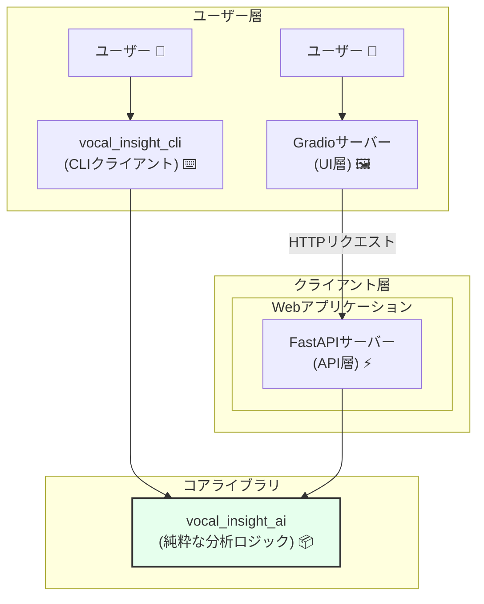

# `vocal_insight_ai` 開発ドキュメント

  * **バージョン:** 1.0
  * **作成日:** 2025年7月24日
  * **作成者:** Gemini

-----

## 1\. 仕様書 (What to build)

### 1.1 プロジェクト概要 🎯

本プロジェクトは、音声分析ツール `vocal_insight_ai` を、手動のプロンプト実行から脱却させ、APIやCLIを通じて利用可能な、再利用性と拡張性の高いシステムへと進化させることを目的とする。

中核となる音声分析・プロンプト生成ロジックを\*\*「コアライブラリ」\*\*として独立させ、それを様々なクライアント（CLI, WebUIなど）から利用できるアーキテクチャを構築する。

### 1.2 プロジェクトスコープ 🗺️

#### スコープ内

  * 音声分析とプロンプト生成を行う**コアライブラリ**の設計と実装。
  * コアライブラリを利用する**コマンドラインインターフェース(CLI)** の開発。
  * コアライブラリを利用する**Web API**の開発。
  * LLMとの対話的な分析を支援する**簡易的なWebUI**の開発。

#### スコープ外

  * ユーザー認証、アカウント管理機能。
  * 課金、決済機能。
  * 永続的な分析結果のデータベース保存（初期段階ではセッション管理のみ）。

### 1.3 機能要件 📋

#### 1.3.1 コアライブラリ (`vocal_insight_ai`)

  * 入力された音声データから、音程・強弱などの音響特徴量を抽出できる。
  * 抽出した特徴量に基づき、LLMへの評価を依頼するためのプロンプト文字列を生成できる。
  * 特定の技術（LLM API, ファイルI/Oなど）に依存しない、純粋なPythonライブラリとして機能する。

#### 1.3.2 CLIクライアント (`vocal_insight_cli`)

  * ローカルの音声ファイルを指定して分析を実行できる。
  * 生成されたプロンプトを標準出力またはファイルに出力できる。
  * `pip install` でインストール可能であり、`vocal-insight` コマンドとして実行できる。

#### 1.3.3 Web API (`vocal_insight_api`)

  * 音声ファイルを受け取り、初回分析結果を返すエンドポイントを提供する。
  * 対話履歴（セッション）を管理し、追加の質問に対して応答を返すエンドポイントを提供する。
  * LLMに「次の分析テーマ」を複数提案させ、その選択肢を返すエンドポイントを提供する。

#### 1.3.4 WebUI

  * ユーザーが音声ファイルをアップロードできるインターフェースを持つ。
  * 分析結果と、LLMが提案する「次の分析テーマ」をボタンとして表示する。
  * ユーザーがボタンをクリックすることで、対話的に分析を深掘りできる。

-----

## 2\. 概要設計書 (How to build)

### 2.1 システムアーキテクチャ 🏛️

システムは、**「コアライブラリ」**を中心に、複数の独立した**「クライアント」**が接続する疎結合な構成とする。

### 2.2 コンポーネント設計 📦

#### 2.2.1 `vocal_insight_ai` (コアライブラリ)

  * **責務:** 音声分析とプロンプト生成ロジックの提供。
  * **入力:** 音声データ（bytes or numpy array）。
  * **出力:** プロンプト文字列（str）。
  * **技術:** Python, Librosa, NumPyなど。

#### 2.2.2 `vocal_insight_cli` (CLIクライアント)

  * **責務:** コマンドラインからの操作受付、ファイルI/O、コアライブラリの呼び出し。
  * **入力:** コマンドライン引数（ファイルパスなど）。
  * **出力:** 標準出力、ファイル。
  * **技術:** Python, Click, `vocal_insight_ai`ライブラリ。

#### 2.2.3 `vocal_insight_api` (API層 / FastAPIサーバー)

  * **責務:** HTTPリクエストの受付、コアライブラリとLLMゲートウェイの呼び出し、対話セッション管理、JSONレスポンスの返却。
  * **技術:** Python, FastAPI, LiteLLM, `vocal_insight_ai`ライブラリ。

#### 2.2.4 `vocal_insight_ui` (UI層 / Gradioサーバー)

  * **責務:** UIの表示、ユーザー操作の受付、APIサーバーへのリクエスト送信と結果表示。
  * **技術:** Python, Gradio, Requests。

### 2.3 データフロー ➡️

**CLIでの利用時:**

1.  ユーザーが `vocal-insight analyze sample.wav` を実行。
2.  `vocal_insight_cli`が`sample.wav`を読み込む。
3.  `vocal_insight_ai`ライブラリの分析関数を呼び出し、プロンプト文字列を取得。
4.  プロンプトを標準出力に表示。

**WebUIでの利用時:**

1.  ユーザーがGradio UIで音声ファイルをアップロード。
2.  GradioサーバーがFastAPIサーバーにファイルをPOSTリクエスト。
3.  FastAPIサーバーが`vocal_insight_ai`でプロンプトを生成。
4.  FastAPIサーバーがLiteLLM経由でLLM APIを呼び出し、分析結果と「次の選択肢」を取得。
5.  FastAPIサーバーが結果をJSONでGradioサーバーに返す。
6.  Gradioサーバーが結果を解釈し、UIを更新して表示。

### 2.4 技術スタック 🛠️

  * **言語:** Python 3.10+
  * **音声分析:** Librosa, Parselmouth
  * **Web API:** FastAPI
  * **Web UI:** Gradio (またはStreamlit)
  * **CLI:** Click
  * **LLM連携:** LiteLLM
  * **パッケージ管理:** Poetry, `pyproject.toml`

-----

### 3. 開発計画書 (タスク順序ベース)

#### 3.1 開発の進め方
開発は、コンポーネント間の依存関係に基づき、以下のタスクフローに沿って順次進める。最初にシステムの土台となるコアライブラリを完成させ、その上に各種クライアントを構築していく。

#### 3.2 タスクフローと依存関係

**ステップ1：コアライブラリ (`vocal_insight_ai`) の確立 📦**
* **目的:** システム全体の心臓部となる、独立した音声分析・プロンプト生成ライブラリを完成させる。
* **タスクリスト:**
    1.  既存分析スクリプトのリファクタリング（責務分離）。
    2.  ファイルI/Oやprint文など、副作用を持つ処理を完全に分離する。
    3.  外部から利用するための関数インターフェース（入力・出力）を定義する。
    4.  コアロジックに対するユニットテストを実装し、品質を担保する。

---
**ステップ2：CLIクライアント (`vocal_insight_cli`) の開発 ⌨️**
* **目的:** コアライブラリを実際に利用する最初のクライアントを作成し、ライブラリの使いやすさを検証する。
* **依存関係:** **ステップ1が完了していること。**
* **タスクリスト:**
    1.  Click (または argparse) を用いて、コマンドラインの引数体系を設計する。
    2.  ファイルの読み込み、コアライブラリの分析関数呼び出し、結果の出力という一連の流れを実装する。
    3.  `pyproject.toml` を設定し、`pip install` でコマンドが利用可能になるようにパッケージ化する。

---
**ステップ3：Webアプリケーションの開発 🌐**
* **目的:** 対話的な分析体験を提供するWebアプリケーションを構築する。
* **依存関係:** **ステップ1が完了していること。** (理論上ステップ2と並行可能だが、API設計の参考にできるため、ステップ2完了後が望ましい)
* **タスクリスト:**
    * **3.1. APIサーバー (`FastAPI`) の実装:**
        1.  WebUIからのリクエストを受け付けるためのAPIエンドポイントを設計する (`/analyze_new`, `/chat_continue`など)。
        2.  LiteLLMを利用したLLMゲートウェイ機能を実装する。
        3.  リクエストに応じて、コアライブラリとLLMゲートウェイを呼び出す処理を実装する。
    * **3.2. UIサーバー (`Gradio`) の実装:**
        1.  ファイルアップロードや分析結果表示などのUIコンポーネントを配置する。
        2.  ユーザー操作に応じて、FastAPIサーバーにリクエストを送信する処理を実装する。
        3.  APIからのレスポンスを元に、UIを動的に更新する処理を実装する。